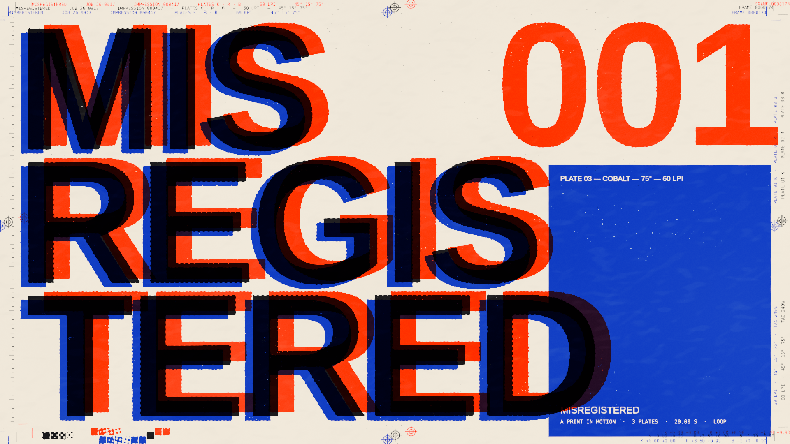
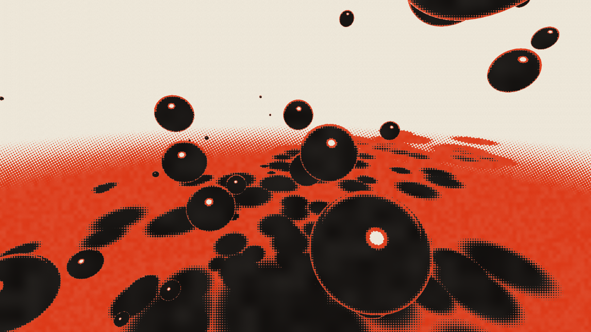
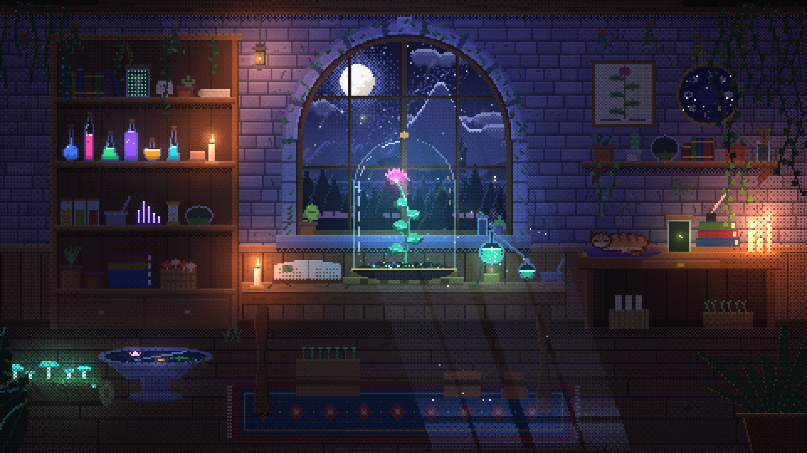
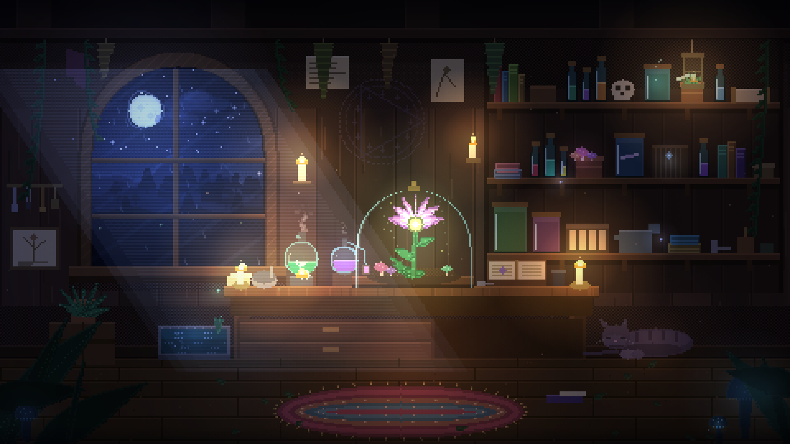
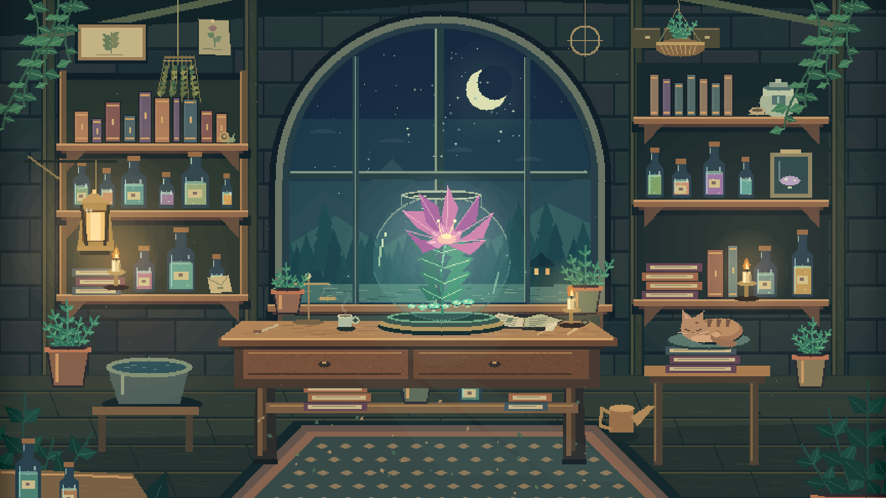
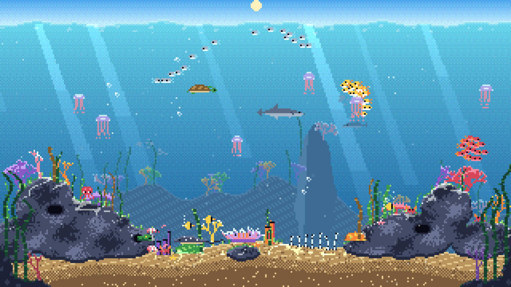

<div align="center">

# AI Creative Lab

**Experiments in AI, Interaction & Creative Coding**

AI × Web で、何ができるかを実験する。

[**Gallery**](https://akkie8.github.io/ai-creative-lab/) · [Zenn](https://zenn.dev/aki1990) · [X](https://x.com/akiy_8)

[](https://akkie8.github.io/ai-creative-lab/works/misregistered/)

</div>

AI Creative Lab は、モデルでつくり、ブラウザで動かし、その結果を観察する個人の実験ラボです。作品はすべて生成されたHTMLのまま展示し、プロンプト・モデル・制作条件・計測値を一緒に公開します。同じ条件で追試し、実装や表現の違いを見比べられるように。記録のない数値は、記録のないまま残します。

## Works

<table>
<tr>
<td width="50%" valign="top"><a href="https://akkie8.github.io/ai-creative-lab/works/misregistered/"></a><br><b>MISREGISTERED</b><br><sub>Claude Opus 5.5 · 2026-09-25 · Motion graphics / WebGL2</sub></td>
<td width="50%" valign="top"><a href="https://akkie8.github.io/ai-creative-lab/works/vermilion-well/"></a><br><b>Vermilion Well</b><br><sub>Claude Opus 5.5 · 2026-09-25 · Motion graphics / WebGL2</sub></td>
</tr>
<tr>
<td width="50%" valign="top"><a href="https://akkie8.github.io/ai-creative-lab/works/moonlit-botanical-laboratory/"></a><br><b>Moonlit Botanical Laboratory</b><br><sub>Claude Opus 5.5 · 2026-09-24 · Pixel animation / Canvas 2D</sub></td>
<td width="50%" valign="top"><a href="https://akkie8.github.io/ai-creative-lab/works/moonlit-herbarium/"></a><br><b>The Moonlit Herbarium</b><br><sub>Claude Opus 5 · 2026-09-24 · Pixel animation / Canvas 2D</sub></td>
</tr>
<tr>
<td width="50%" valign="top"><a href="https://akkie8.github.io/ai-creative-lab/works/nocturnal-conservatory/"></a><br><b>The Nocturnal Conservatory</b><br><sub>GPT-6 Astra · 2026-09-24 · Pixel animation / Canvas 2D</sub></td>
<td width="50%" valign="top"><a href="https://akkie8.github.io/ai-creative-lab/works/coral-reef-day/"></a><br><b>サンゴ礁の一日 / Coral Reef Day</b><br><sub>Claude Opus 5.5 · 2026-09-23 · Pixel animation / Canvas 2D</sub></td>
</tr>
</table>

| 作品名 | モデル | 作成日 | 技法 | シリーズ |
| --- | --- | --- | --- | --- |
| [MISREGISTERED](https://akkie8.github.io/ai-creative-lab/works/misregistered/) | Claude Opus 5.5（Claude Code） | 2026-09-25 | Motion graphics / WebGL2 / Kinetic typography / Halftone / Single HTML | — |
| [Vermilion Well](https://akkie8.github.io/ai-creative-lab/works/vermilion-well/) | Claude Opus 5.5（Claude Code） | 2026-09-25 | Motion graphics / WebGL2 / Shader / Single HTML | — |
| [Moonlit Botanical Laboratory](https://akkie8.github.io/ai-creative-lab/works/moonlit-botanical-laboratory/) | Claude Opus 5.5 | 2026-09-24 | Pixel animation / Canvas 2D / Single HTML | Magical Botanical Laboratory |
| [The Moonlit Herbarium](https://akkie8.github.io/ai-creative-lab/works/moonlit-herbarium/) | Claude Opus 5 | 2026-09-24 | Pixel animation / Canvas 2D / Single HTML | Magical Botanical Laboratory |
| [The Nocturnal Conservatory](https://akkie8.github.io/ai-creative-lab/works/nocturnal-conservatory/) | GPT-6 Astra | 2026-09-24 | Pixel animation / Canvas 2D / Single HTML | Magical Botanical Laboratory |
| [サンゴ礁の一日 / Coral Reef Day](https://akkie8.github.io/ai-creative-lab/works/coral-reef-day/) | Claude Opus 5.5 | 2026-09-23 | Pixel animation / Canvas 2D / Single HTML | — |

## The loop

| Experiment → | Artifact → | Engineering → | Distribution |
| --- | --- | --- | --- |
| モデルで作る | Labに実物を公開 | Zennに作り方と違いを書く | Xに動画を出す |

**Fields** — **Pixel Art** (4) · **Motion** (2) · Generative Art · 3D · Voice · Realtime UI · Agent UI · Character · Interactive Web · Visualization

## MISREGISTERED

印刷の失敗が振り付けになる、20秒でループするモーショングラフィックス。黒・蛍光の赤橙・コバルトの3版で刷ったポスターが見当ズレを起こし、網点に溶け、刻印され、裁断され、一瞬だけ完全に見当が合って PERFECT IS BORING. が現れ、小さな誤差から冒頭に戻ります。HTML 1ファイル（1,005行・54,182 bytes）で、画像・動画・ライブラリ・Webフォントは使わず、端末の書体を読み込んでWebGL2で毎フレーム刷っています。

- [作品を開く](experiments/misregistered/opus-5-5/index.html) · [制作記録](https://akkie8.github.io/ai-creative-lab/works/misregistered/) · [プロンプト](experiments/misregistered/prompt.md) · [作品のREADME](experiments/misregistered/README.md)
- 作成日：2026-09-25。Claude Code（Opus 5.5、Effort xhigh）にプロンプトを1回送り、追加の指示はなし。Claude自身が撮影と修正を繰り返しています。
- 生成時間 54分26秒（セッション開始から作品のコミットまで）/ モデル呼び出し回数は記録なし / Input 25,179,768（うちキャッシュ読出し 24,747,011）/ Output 249,675 / Total 25,429,443 tokens。使用量はセッション単位の累計で、ギャラリー追加の作業が始まった時点までを含みます。セッション表示のコストは $13.38（参考値）。
- 実機のフレーム時間は未計測です（確認はGPUのない環境のソフトウェア描画）。
- MP4はリポジトリに含めていません。[書き出しツール](experiments/misregistered/export/)で作れます。

## Vermilion Well

黒・朱・紙の3色でめぐる、15秒でループするモーショングラフィックス。HTML 1ファイル（434行・26,993 bytes）で、画像・動画・ライブラリは使わず、絵はすべてWebGL2のシェーダで毎フレーム計算しています。

- [作品を開く](experiments/vermilion-well/opus-5-5/index.html) · [制作記録](https://akkie8.github.io/ai-creative-lab/works/vermilion-well/) · [プロンプトと出典](experiments/vermilion-well/prompt.md) · [作品のREADME](experiments/vermilion-well/README.md)
- 作成日：2026-09-25。Claude Code（Opus 5.5）にプロンプトを1回送り、追加の指示はなし。Claude自身が撮影と修正を繰り返しています。
- 生成時間 36分25秒 / モデル呼び出し 39回 / Input 7,541,527（うちキャッシュ読出し 7,282,290）/ Output 178,711 / Total 7,720,238 tokens。作品を作ったセッションのログから集計した値で、コンテキスト上限による自動要約1回を含みます。API換算コストは未算出です。
- MP4はリポジトリに含めていません。[書き出しツール](experiments/vermilion-well/export/)で作り直せます。

## サンゴ礁の一日

Claude Opus 5.5が描いた、20秒で昼夜がめぐるサンゴ礁。320×180、30色パレット、Canvas 2Dの単一HTMLです。外部ライブラリ・画像はありません。

- [作品を開く](experiments/coral-reef/opus-5-5/index.html) · [制作記録](https://akkie8.github.io/ai-creative-lab/works/coral-reef-day/) · [生成プロンプトと追加指示](experiments/coral-reef/prompt.md)
- 作成日：2026-09-23。別のClaudeとの対話でプロンプトを作成し、生成途中に「今更だけど20秒くらいのアニメーションでも充分」と追加指示を1回送っています。
- 生成時間・トークン・コスト：記録なし。
- 収録版は2026-09-25取得の[Vercel公開版](https://coral-reef-site.vercel.app/coral-reef.html)。実測472行・43,727 bytes。[Zenn記事](https://zenn.dev/peoplex_blog/articles/1bc5c181ad19f0)の470行・43,528 bytesとは差があります。
- ギャラリーでは作品HTMLをiframeでそのまま表示しています。一覧のサムネイル `assets/coral-reef.png` は作品の画面を1920×1080（ドット6倍）で撮影したものです。

## Magical Botanical Laboratory（同じプロンプト・3モデル）

「魔法使いの植物研究室」をテーマにした、眺め続けられるピクセルアニメーション。同じ文章から生まれた3つの世界を、元のHTMLのまま展示しています。

| モデル | 作品を見る | ソースコード |
| --- | --- | --- |
| GPT-6 Astra | [The Nocturnal Conservatory](https://akkie8.github.io/ai-creative-lab/experiments/magical-botanical-laboratory/astra/) | [index.html](experiments/magical-botanical-laboratory/astra/index.html) |
| Claude Opus 5 | [The Moonlit Herbarium](https://akkie8.github.io/ai-creative-lab/experiments/magical-botanical-laboratory/opus-5/) | [index.html](experiments/magical-botanical-laboratory/opus-5/index.html) |
| Claude Opus 5.5 | [Moonlit Botanical Laboratory](https://akkie8.github.io/ai-creative-lab/experiments/magical-botanical-laboratory/opus-5-5/) | [index.html](experiments/magical-botanical-laboratory/opus-5-5/index.html) |

### 共通条件

- **Same prompt**：同一の[プロンプト全文](prompt.md)を使用。
- **High**：各モデルの推論設定を `high` に指定。
- **One-shot**：最初の生成依頼以降、完成まで人間による追加指示なし。モデル自身によるツール利用、複数回の呼び出し、自己検証・修正は含みます。
- **Human edits 0**：生成された作品への人間の修正は0件。公開時も3つのHTMLをバイト単位で保持しています。
- **Single HTML**：HTML / CSS / JavaScriptのみ。1作品につき `index.html` 1枚。外部画像・フォント・ライブラリ・API・ネットワーク要求なし。

ギャラリーと説明文は公開用に別途作成しました。Human edits 0 は3つの作品本体に対する条件です。Opus 5.5は、初回呼び出しが出力上限に達した後の**システムによる自動続行1回**を含みます。

### 結果

以下の時間・使用量・料金は、生成セッションから取得したとして提供された報告値です。今回の公開作業の時間・トークンは含みません。生の生成ログはこのリポジトリには含まれていません。

| 指標 | GPT-6 Astra | Claude Opus 5 | Claude Opus 5.5 |
| --- | ---: | ---: | ---: |
| Effort | high | high | high |
| One-shot / Human edits | Yes / 0 | Yes / 0 | Yes / 0 |
| 生成時間 | 9分30秒 | 17分28秒 | 45分52秒 |
| モデル呼び出し | 未取得 | 25回 | 29回 |
| Input tokens（累計） | 683,072 | 3,279,118 | 4,794,271 |
| うちキャッシュ読出し | 632,704 | 3,163,568 | 4,593,167 |
| Output tokens | 16,930 | 73,149 | 236,961 |
| Total processed tokens | 700,002 | 3,352,267 | 5,031,232 |
| API換算コスト（USD、参考） | 約$1.98 | 約$4.57 | 約$7.27 |
| コード行数（元報告） | 196 | 1,292 | 730 |
| 配布HTMLの実測行数 | 195 | 1,292 | 730 |
| 配布HTMLのサイズ（bytes） | 25,455 | 48,492 | 58,855 |

API換算コストは**実際の請求額ではありません**。元報告で使われた単価を前提に再計算した参考値で、現在の公式価格を保証するものではありません。Opus 5.5のキャッシュ単価などに未確認の前提があります。時間の終点や行数の相違も含め、[metrics.md](metrics.md)に記載しています。

### 読み取り方

各モデル1試行ずつの観察です。Highという設定名は共通ですが、計算量、エージェント環境、利用ツール、自己修正回数まで同一ではありません。単純なモデル性能のランキングや、次回も同じ作品・費用になることを示すものではありません。

同じ画面サイズで開き、しばらく眺めてから比較してください。構図、光、動きの周期、ランダムイベント、要素同士の反応を見ると違いを観察できます。作品ごとに画面への収め方が違うため、表示領域が同じでも見える範囲や余白は異なります。

## ローカルで見る・追試する

1. このリポジトリをダウンロードまたはcloneします。
2. リポジトリ内で `python3 -m http.server 8000` を実行し、`http://localhost:8000` を開きます。カードから各作品へ移動できます。

Magical Botanical Laboratoryを追試する場合は、新しいセッションに [prompt.md](prompt.md) の全文を渡し、モデルと `high` を指定してください。完成まで人間から追加の指示・修正を行わず、最初の依頼から納品までの時間とusageを記録します。モデル名・実行環境・自動続行の有無も残してください。生成は確率的であり、同一出力を保証しません。

## 作品の追加方法

1. 既存の `works/<slug>/index.html` を複製し、作品・モデル・作成日・技法・条件・計測値・プロンプト・関連リンクを更新します。共通CSSは `assets/site.css` を使います。
2. トップのIndexにカードを1つ追加します。HTML作品は `.media` 内に iframe でそのまま埋め込み、画像や動画の作品は `` / `<video>` を置きます。必要に応じてFeaturedも更新します。
3. 作品HTMLをそのまま収録し、`shasum -a 256 <作品HTML>` の出力を `checksums.sha256` に追記します。READMEの作品一覧も更新します。
4. ローカルサーバーで相対リンクと表示を確認し、`shasum -a 256 -c checksums.sha256` を実行します。

## 構成

```text
index.html                              # Featured / Index / Fields / About
assets/
  site.css                              # 7ページ共通CSS
  pixel-fit.js                          # サンゴ礁の整数倍表示
  copy.js                               # プロンプトのコピー
  misregistered.png
  vermilion-well.png
  coral-reef.png
  moonlit-botanical-laboratory.png
  moonlit-herbarium.png
  nocturnal-conservatory.png
  *.jpg                                 # 既存の比較素材・OGP
works/
  misregistered/index.html
  vermilion-well/index.html
  moonlit-botanical-laboratory/index.html
  moonlit-herbarium/index.html
  nocturnal-conservatory/index.html
  coral-reef-day/index.html
prompt.md                               # 植物研究室の共通プロンプト全文
metrics.md                              # 植物研究室の計測記録・換算前提
README.md
checksums.sha256                        # 6作品のSHA-256
experiments/misregistered/
  README.md
  prompt.md
  opus-5-5/index.html                    # 作品原本
  export/                               # MP4書き出しツール（エンコーダはVermilion Wellと共用）
experiments/vermilion-well/
  README.md
  prompt.md
  opus-5-5/index.html                    # 作品原本
  export/                               # Python + SwiftのMP4書き出しツール
experiments/coral-reef/
  prompt.md
  opus-5-5/index.html                    # 作品原本
experiments/magical-botanical-laboratory/
  astra/index.html
  opus-5/index.html
  opus-5-5/index.html
```

ビルドや依存パッケージは不要です。GitHub Pagesは `main` ブランチのルートを公開元にします。

## 原本とプレビュー

`checksums.sha256` は植物研究室の元の添付HTML、サンゴ礁・Vermilion Well・MISREGISTEREDの収録HTMLから作成しています。リポジトリのルートで `shasum -a 256 -c checksums.sha256` を実行すると一致を確認できます。

既存の植物研究室のJPEG画像は別途作成した比較素材です。各作品の表示領域は640×480 CSS px、表示倍率100%、devicePixelRatio 1、reduced-motionはno-preference。Chromiumの共通仮想時計で64msのウォームアップ後、12秒時点を撮影したものです。単体画像にはモデル名と生成時間のラベルを加えています。乱数は固定していないため、再読込時のイベントは一致しない場合があります。画像のラベルやギャラリーの装飾は作品本体には含まれません。

一覧用の植物研究室のPNGは、作品を960×540 CSS px・deviceScaleFactor 2で開き、読み込み後3秒待って1920×1080で撮影しています。詳細ページでは、作品HTMLを4:3のiframeでそのまま表示します。

## 公開範囲

本リポジトリは作品・条件・実測報告を閲覧し、実験内容を検証するための公開アーカイブです。現時点では再配布・改変に関するライセンスは設定していません。

## Author

**Aki** — Product Engineer @ PeopleX<br>
Building AI products · Creative Coding · AI Experiments<br>
所属：[株式会社PeopleX](https://corp.peoplex.jp/) · [Zenn](https://zenn.dev/aki1990) · [X](https://x.com/akiy_8) · [GitHub](https://github.com/akkie8)
