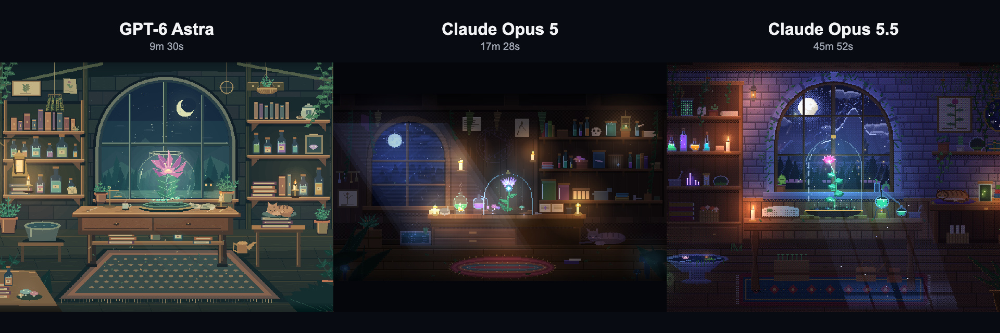

# AI Creative Lab

**Reproducible AI Creative Experiments — 再現可能なAIクリエイティブ研究ログ。**

同じプロンプトを異なるAIモデルに渡したとき、どんな作品が生まれるのか。作品だけでなく、プロンプト、生成条件、時間、トークン使用量、API換算コストを一緒に公開する個人の実験記録です。クリエイターやプロダクトエンジニアが、表現と制作に必要な時間・計算量を見比べ、同じ条件で追試できることを目指します。

**[ギャラリーを見る](https://akkie8.github.io/ai-creative-lab/)** · [プロンプト全文](prompt.md) · [実測データと集計方法](metrics.md)

[](https://akkie8.github.io/ai-creative-lab/)

## Experiment 001 — Magical Botanical Laboratory

「魔法使いの植物研究室」をテーマにした、眺め続けられるピクセルアニメーション。同じ文章から生まれた3つの世界を、元のHTMLのまま展示しています。

| モデル | 作品を見る | ソースコード |
| --- | --- | --- |
| GPT-6 Astra | [The Nocturnal Conservatory](https://akkie8.github.io/ai-creative-lab/experiments/magical-botanical-laboratory/astra/) | [index.html](experiments/magical-botanical-laboratory/astra/index.html) |
| Claude Opus 5 | [The Moonlit Herbarium](https://akkie8.github.io/ai-creative-lab/experiments/magical-botanical-laboratory/opus-5/) | [index.html](experiments/magical-botanical-laboratory/opus-5/index.html) |
| Claude Opus 5.5 | [Moonlit Botanical Laboratory](https://akkie8.github.io/ai-creative-lab/experiments/magical-botanical-laboratory/opus-5-5/) | [index.html](experiments/magical-botanical-laboratory/opus-5-5/index.html) |

### 共通条件

- **Same prompt**：同一の[プロンプト全文](prompt.md)を使用。
- **High**：各モデルの推論設定を `high` に指定。
- **One-shot**：最初の生成依頼以降、完成まで人間による追加指示なし。モデル自身によるツール利用、複数回の呼び出し、自己検証・修正は含みます。
- **Human edits 0**：生成された作品への人間の修正は0件。公開時も3つのHTMLをバイト単位で保持しています。
- **Single HTML**：HTML / CSS / JavaScriptのみ。1作品につき `index.html` 1枚。外部画像・フォント・ライブラリ・API・ネットワーク要求なし。

ギャラリーと説明文は公開用に別途作成しました。Human edits 0 は3つの作品本体に対する条件です。Opus 5.5は、初回呼び出しが出力上限に達した後の**システムによる自動続行1回**を含みます。

### 結果

以下の時間・使用量・料金は、生成セッションから取得したとして提供された報告値です。今回の公開作業の時間・トークンは含みません。生の生成ログはこのリポジトリには含まれていません。

| 指標 | GPT-6 Astra | Claude Opus 5 | Claude Opus 5.5 |
| --- | ---: | ---: | ---: |
| Effort | high | high | high |
| One-shot / Human edits | Yes / 0 | Yes / 0 | Yes / 0 |
| 生成時間 | 9分30秒 | 17分28秒 | 45分52秒 |
| モデル呼び出し | 未取得 | 25回 | 29回 |
| Input tokens（累計） | 683,072 | 3,279,118 | 4,794,271 |
| うちキャッシュ読出し | 632,704 | 3,163,568 | 4,593,167 |
| Output tokens | 16,930 | 73,149 | 236,961 |
| Total processed tokens | 700,002 | 3,352,267 | 5,031,232 |
| API換算コスト（USD、参考） | 約$1.98 | 約$4.57 | 約$7.27 |
| コード行数（元報告） | 196 | 1,292 | 730 |
| 配布HTMLの実測行数 | 195 | 1,292 | 730 |
| 配布HTMLのサイズ（bytes） | 25,455 | 48,492 | 58,855 |

API換算コストは**実際の請求額ではありません**。元報告で使われた単価を前提に再計算した参考値で、現在の公式価格を保証するものではありません。Opus 5.5のキャッシュ単価などに未確認の前提があります。時間の終点や行数の相違も含め、[metrics.md](metrics.md)に記載しています。

### 読み取り方

各モデル1試行ずつの観察です。Highという設定名は共通ですが、計算量、エージェント環境、利用ツール、自己修正回数まで同一ではありません。単純なモデル性能のランキングや、次回も同じ作品・費用になることを示すものではありません。

同じ画面サイズで開き、しばらく眺めてから比較してください。構図、光、動きの周期、ランダムイベント、要素同士の反応を見ると違いを観察できます。作品ごとに画面への収め方が違うため、表示領域が同じでも見える範囲や余白は異なります。

## ローカルで見る・追試する

1. このリポジトリをダウンロードまたはcloneします。
2. ルートの `index.html` をブラウザで開きます。カードから各作品へ移動できます。
3. HTTPで確認する場合は、リポジトリ内で `python3 -m http.server 8000` を実行し、`http://localhost:8000` を開きます。

追試する場合は、新しいセッションに [prompt.md](prompt.md) の全文を渡し、モデルと `high` を指定してください。完成まで人間から追加の指示・修正を行わず、最初の依頼から納品までの時間とusageを記録します。モデル名・実行環境・自動続行の有無も残してください。生成は確率的であり、同一出力を保証しません。

## 構成

```text
index.html                              # Gallery
prompt.md                               # 共通プロンプト全文
metrics.md                              # 使用量・換算前提・データの限界
README.md
checksums.sha256                        # 3作品のSHA-256
assets/                                 # 作品プレビュー
experiments/magical-botanical-laboratory/
  astra/index.html
  opus-5/index.html
  opus-5-5/index.html
```

ビルドや依存パッケージは不要です。GitHub Pagesは `main` ブランチのルートを公開元にします。

## 原本とプレビュー

`checksums.sha256` は元の添付HTMLから作成しています。リポジトリのルートで `shasum -a 256 -c checksums.sha256` を実行すると一致を確認できます。

プレビュー画像は別途作成した比較素材を使用しています。各作品の表示領域は640×480 CSS px、表示倍率100%、devicePixelRatio 1、reduced-motionはno-preference。Chromiumの共通仮想時計で64msのウォームアップ後、12秒時点を撮影したものです。単体画像にはモデル名と生成時間のラベルを加えています。乱数は固定していないため、再読込時のイベントは一致しない場合があります。画像のラベルやギャラリーの装飾は作品本体には含まれません。

## 公開範囲

本リポジトリは作品・条件・実測報告を閲覧し、実験内容を検証するための公開アーカイブです。現時点では再配布・改変に関するライセンスは設定していません。
